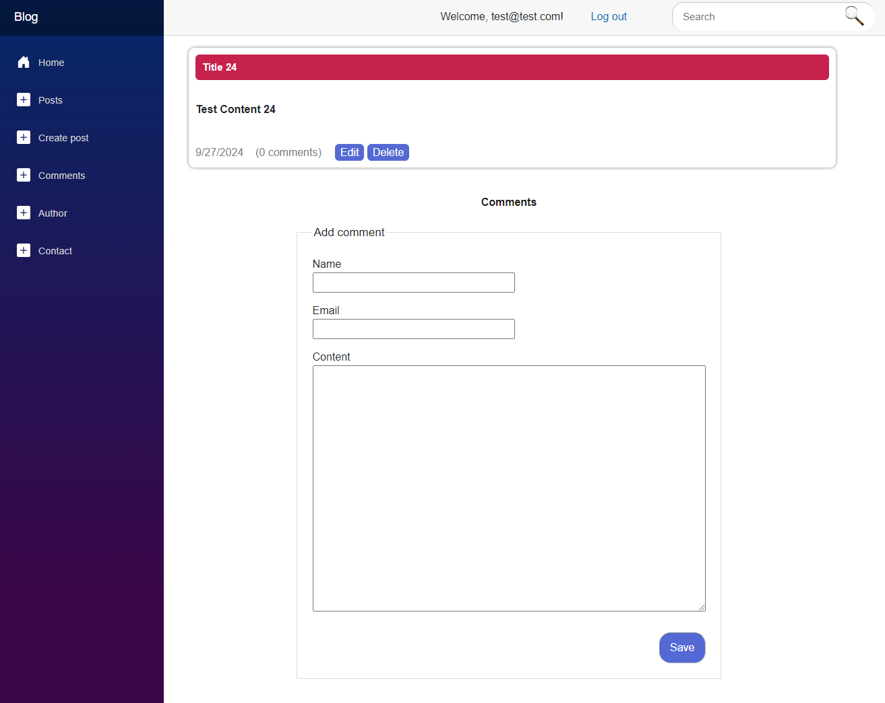
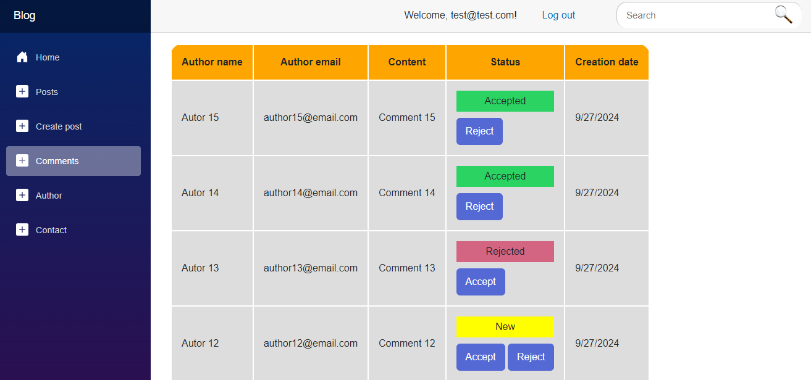

# A simple BLOG






## Architecture

- Domain-driven design (DDD)
- Clean Architecture
- CQRS

## Technologies
- .NET 8.0
- C# 12
- Blazor WebAssembly
- ASP.NET Core Web API
- Entity Framework
- Dapper ORM
- AutoMapper
- NLog
- MediatR
- FluentValidation


## Main layers

| Layer | Description |
| ------ | ------ |
| Blog | API |
| Blog.Client | Blazor application |
| Blog.Application | Communication with Domain Layer |
| Blog.Infrastructure | Persistence |
| Blog.Domain | Core business logic |


## How to run the application
Fill fields in appsettings.json, create database - in Package Manager Console for Blog.Infrastructure project run:
```sh
update-database
```
Launch the application!


## If you want to add a post or manage comments in the application use the following data to log in
Login:
`test@test.com`
Password:
`Test123*`


## About the Author
Michał Misiukanis
[Linkedin](https://www.linkedin.com/in/micha%C5%82-misiukanis-875129119/)

